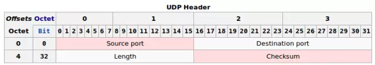
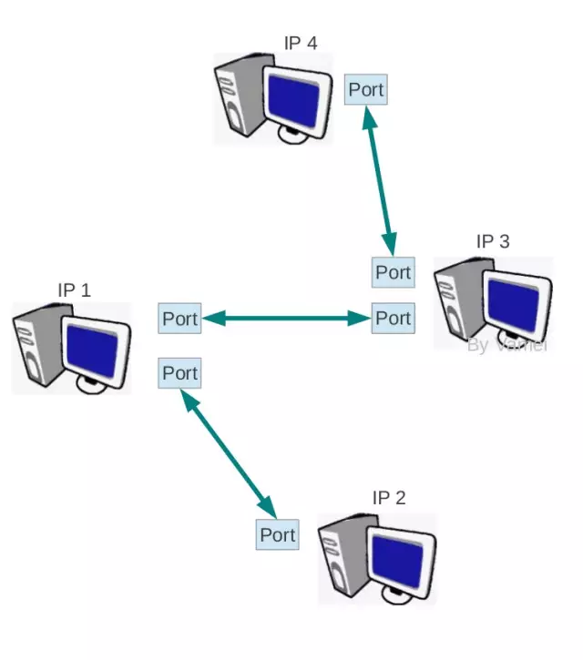

`传输层最重要的协议为 TCP协议 和 UDP协议 `。这两者走了两个极端，`TCP 协议复杂，但传输可靠`。`UDP 协议简单，但传输不可靠`。其他的各个传输层协议在某种程度上都是这两个协议的折中。我们先来看传输层协议中比较简单的UDP协议。我们将参考许多之前文章的内容。

## UDP协议简介

UDP(User Datagram Protocol)传输与IP传输非常类似。你可以将UDP协议看作IP协议暴露在传输层的一个接口。UDP协议同样以数据包(datagram)的方式传输，它的传输方式也是"Best Effort"的，所以UDP协议也是不可靠的(unreliable)。那么，我们为什么不直接使用IP协议而要额外增加一个UDP协议呢？

一个重要的原因是`IP协议中并没有端口(port)的概念`。IP协议进行的是IP地址到IP地址的传输，这意味者两台计算机之间的对话。但每台计算机中需要有多个进程同时运行，当前到底和哪一个进程通信了？端口就是用来区分这个的。一个端口就代表了一个进程。`UDP协议实现了端口 ，从而让数据包可以在送到IP地址的基础上，进一步可以送到某个端口`。

尽管UDP协议非常简单，但它的产生晚于更加复杂的TCP协议。早期的网络开发者开发出的IP协议和TCP协议分别位于网络层和传输层，所有的通信都要先经过TCP封装，再经过IP封装(应用层->TCP->IP)。开发者将TCP/IP视为相互合作的套装。

但很快，网络开发者发现，IP协议的功能和TCP协议的功能是相互独立的。对于一些简单的通信，我们只需要“Best Effort”式的IP传输就可以了，而不需要TCP协议复杂的建立连接的方式(特别是在早期网络环境中，如果过多的建立TCP连接，会造成很大的网络负担，而UDP协议可以相对快速的处理这些简单通信)。UDP协议随之被开发出来，作为IP协议在传输层的"傀儡"。

这样，网络通信可以通过应用层->UDP->IP的封装方式，绕过TCP协议。由于UDP协议本身异常简单，实际上只为IP传输起到了桥梁的作用。我们将在TCP协议的讲解中看到更多TCP协议和UDP协议的对比。

## UDP协议头部

`上面的 Source port 和 Destination port 分别为 UDP包 的 出发端口 和 目的地端口 。Length 为整个UDP包的长度`。checksum的算法与IP协议的header checksum算法（戳我）相类似。不同的是，UDP的checksum所校验的序列包括了整个UDP数据包，以及封装的IP头部的一些信息(主要为出发地IP和目的地IP)。这样，`checksum 就可以校验IP : 端口的正确性`了。在IPv4中，checksum可以为0，意味着不使用checksum。IPv6要求必须进行checksum校验。

## 端口与socket

`(port) 是伴随着传输层诞生的概念。它可以将网络层的IP通信分送到各个通信通道。 UDP协议 和 TCP协议 尽管在工作方式上有很大的不同，但它们都建立了从 一个端口到另一个端口 的通信`。

随着我们进入传输层，我们也可以调用操作系统中的API，来构建socket。`Socket 是操作系统提供的 一个编程接口 ，它用来代表某个网络通信。应用程序通过socket来 调用系统内核中处理网络协议的模块 ，而这些内核模块会负责具体的网络协议的实施`。

这样，我们可以让内核来接收网络协议的细节，而我们只需要提供所要传输的内容就可以了，内核会帮我们控制格式，并进一步向底层封装。因此，在实际应用中，我们并不需要知道具体怎么构成一个UDP包，而只需要提供相关信息(比如IP地址，比如端口号，比如所要传输的信息)，操作系统内核会在传输之前会根据我们提供的相关信息构成一个合格的UDP包(以及下层的包和帧)。

## 总结

端口是传输层带来的最重要的概念。我们进一步了解了UDP协议。如果已经掌握了IP协议，那么UDP协议就没有任何困难可言，它只是IP协议暴露在传输层上的接口。