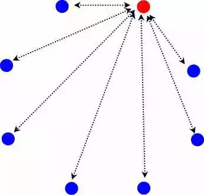
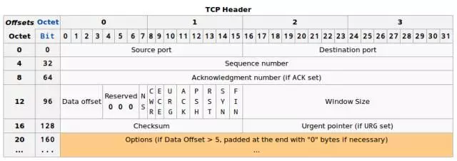
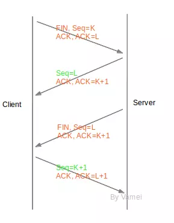

**TCP通信最重要的特征是：`有序(ordering)`和`可靠(reliable)`。`有序`是通过将`文本流分段并编号`实现的。`可靠`是通过`ACK回复`和`重复发送(retransmission)`实现的。**这一篇文章将引入TCP连接(connection)的概念。主要包括下面几个内容：

>1、TCP连接概念
>2、TCP头部格式
>3、TCP建立连接
>4、TCP终止连接

## TCP连接概念

**传输层在逻辑上提供了`端口`区分同一主机的不同进程**。一个IP地址可以有多个端口。一个具体的端口需要IP地址和端口号共同确定(我们记为IP:port的形式)。**一个连接为两个`IP:port`之间建立TCP通信**。(一个常用的比喻为：TCP连接就像两个人打电话， IP为总机号码，port为分机号码)

参与连接的如果是两台电脑，那么两台电脑操作系统的TCP模块负责建立连接。**每个连接有四个参数(两个IP，两个端口)，来表明“谁在和谁通话”**。每台电脑都会记录有这四个参数，以确定是哪一个连接。如果这四个参数完全相同，则为同一连接；如果这四个参数有一个不同，即为不同的连接。这意味着，同一个端口上可以有多个连接。内核中的TCP模块生成连接之后，将连接分配给进程使用。

**TCP连接是`双向(duplex)`的**。在TCP协议与"流"通信中，我们所展示的TCP传输是单向的。双向连接实际上就是建立两个方向的TCP传输，所以概念上并不复杂。这时，连接的每一方都需要两个滑窗，以分别处理发送的文本流和接收的文本流。由于连接的双向性，我们也要为两个方向的文本流编号。这两个文本流的编号相互独立。为文本流分段和编号由发送方来处理，回复ACK则由接收的一方进行。

## TCP头部格式

在深入TCP连接之前，我们需要对TCP片段的头部格式有一些了解。我们知道，**TCP片段分为`头部`和`数据`**。数据部分为TCP真正传输的文本流数据。下面为TCP片段的头部格式：

先关注下面几点：

>1. 一个TCP头部需要包含`出发端口(source port)`和`目的地端口(destination port)`。这些与IP头中的两个IP地址共同确定了连接。
>
>2. 每个TCP片段都有`序号(sequence number)`。这些序号最终将数据部分的文本片段整理成为文本流。
>
>3. `ACK`是一位(bit)。只有ACK位设定的时候，`回复号(Acknowledgement number)`才有效。ACK回复号说明了接收方期待接收的下一个片段，所以ACK回复号为最后接收到的片段序号加1。
>很多时候，`ACK回复“附着”在发送的数据片段中`。TCP协议是双向的。比如A和B两个电脑。ACK回复是接收方回复给发送方 (比如A发送给B， B回复A)。但同时，B也可以是发送方，B有可能有数据发送给A，所以B就把ACK回复附着在它要发送给A的数据片段的头部。这样可以减少ACK所占用的交通流量。
>一个片段可以也只单纯包含ACK回复。一个纯粹的ACK回复片段不传送文本流，所以不消耗序列号。如果有下一个正常的数据片段，它的序号将与纯粹ACK回复片段的序号相同。
>
>4. ACK后面还有`SYN`和`FIN`，它们也各占据一位(bit)。我将在后面说明这两位。

## TCP建立连接

TCP传输需要一个前提：TCP连接已经建立。然而，TCP连接从无到有需要一个建立连接的过程。**建立连接的最重要目是让连接的双方交换`初始序号(ISN, Initial Sequence Number)`**。

根据TCP协议的规定，文本流的第一个片段的序号不能是确定的数字(比如说1)。连接的双方各自**随机生成自己的ISN**，然后再利用的一定方式让对方了解。这样的规定是出于TCP连接安全考虑：如果以一个确定的数字作为初始的TCP序号，那么其他人很容易猜出接下来的序列号，并按照正确的序号发送“伪装”的TCP片段，以插入到文本流中。

**`ISN交换`是通过`SYN片段`实现的**。SYN片段由头部的SYN位表明，它的序号为发送方的ISN。该片段由连接的一方首先发给给另一方，我们将发送SYN的一方称为客户(client)，而接收SYN的一方称为服务器(server)。我们使用ISN(c)表示client一方的ISN，使用ISN(s)表示server一方的ISN。随后，接收到SYN的server需要回复ACK，并发送出包含有server的ISN的SYN片段。

下图为建立连接的过程，也就是经典的`TCP三次握手(three-way handshaking)`。两条竖直线分别为client和server的时间轴。每个箭头代表了一次TCP片段的单向传输。

**青色为纯粹的ACK片段。整个过程的本质是双方互发含有自己的ISN的SYN片段**。根据TCP传输的规则，接收到ISN的一方需要回复ACK，所以共计四片信息在建立连接过程中传输。之所以是三次握手 (而不是四次)，是因为**server将发送SYN和回复ACK合并到一个TCP片段中**。

我们以client方为例。client知道自己的ISN(也就是ISN(c))。建立连接之后，它也知道了对方的ISN(s)。此后，如果需要发送文本流片段，则编号为ISN(c) + 1, ISN(c) + 2 ...。如果接收文本流片段，则期待接收ISN(s) + 1, ISN(s) + 2 ...。

连接建立之后，连接的双方就可以按照TCP传输的方式相互发送文本流了。

## TCP终结连接

一个连接建立之后，连接两端的进程可以利用该连接进行通信。当连接的一方觉得“我讲完了”，它可以终结连接中发送到对方方向的通信。**连接最终通过`四次握手(four-way handshaking)`的方式终结，连接终结使用的是特殊片段`FIN(FIN位为1的片段)`**。

我们可以看到，**连接终结的过程中，连接双方也交换了四片信息(`两个FIN`和`两个ACK`)。在终结连接的过程中，TCP并没有合并FIN与ACK片段。原因是TCP连接允许`单向关闭(half-close)`**。

也就是说，TCP连接关闭了一个方向的传输，成为一个单向连接(half-duplex)。第二个箭头和第三个箭头传递必须分开，才能有空隙在开放的方向上继续传输。如果第二个箭头和第三个箭头合并在一起，那么，随着一方关闭，另一方也要被迫关闭。

第二和第三次握手之间，server可以继续单向的发送片段给client，但client不能发送数据片段给server。

(上面的终结从client先发起，TCP连接终结也可以从server先发起。)

在Client发送出最后的ACK回复，但该ACK可能丢失。Server如果没有收到ACK，将不断重复发送FIN片段。所以Client不能立即关闭，它必须确认Server接收到了该ACK。Client会在发送出ACK之后进入到著名的`TIME_WAIT状态`。

Client会设置一个计时器，等待2MSL的时间。如果在该时间内再次收到FIN，那么Client会重发ACK并再次等待2MSL。所谓的2MSL是两倍的MSL(Maximum Segment Lifetime)。**MSL指一个片段在网络中最大的存活时间**，2MSL就是一个发送和一个回复所需的最大时间。如果直到2MSL，Client都没有再次收到FIN，那么Client推断ACK已经被成功接收，则结束TCP连接。

## 总结

TCP是连接导向的协议，与之对应的是像UDP这样的非连接导向的协议。连接能带来更好的传输控制，但也需要更多额外的工作，比如连接的建立和终结。

我们还初步了解了TCP的头部格式。应该注意到，许多时候我们将ACK片段“附着”在其他片段上。相对于纯粹的ACK片段，我们这样做节约了ACK所需的流量。事实上，由于ACK片段所需的ACK位和acknowledge number区域总是存在于TCP的头部，所以附着ACK片段的成本基本上等于0。

