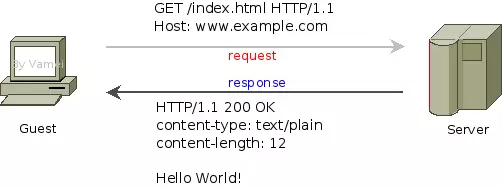

TCP协议实现了数据流的可靠传输。然而，人们更加习惯以文件为单位传输资源，比如文本文件，图像文件，超文本文档(hypertext document)。

超文本文档中包含有超链接，指向其他的资源。**`超文本文档`是万维网(World Wide Web，即www)的基础。**

**`HTTP协议`解决`文件传输`的问题**。HTTP是应用层协议，主要建立在TCP协议之上(偶尔也可以UDP为底层)。它随着万维网的发展而流行。HTTP协议目的是，如何在万维网的网络环境下，更好的利用TCP协议，以实现文件，特别是超文本文件的传输。

早期的HTTP协议主要传输静态文件，即真实存储在服务器上的文件。随着万维网的发展，HTTP协议被用于传输“动态文件”，服务器上的程序根据HTTP请求即时生成的动态文件。我们**将HTTP的传输对象统称为`资源(resource)`**。

## 点单

HTTP实现了资源的订购和传送。其工作方式类似于快餐点单。

>1：`请求(request)`: 顾客向服务员提出请求：“来个鸡腿汉堡”。
>2：`回复(response)`:服务员根据情况，回应顾客的请求


根据情况的不同，服务员的回应可能有很多，比如:

服务员准备鸡腿汉堡，将鸡腿汉堡交给顾客。（一切OK）

服务员发现自己只是个甜品站。他让顾客前往正式柜台点单。（重新定向）

服务员告诉顾客鸡腿汉堡没有了。(无法找到)

交易结束后，服务员就将刚才的交易抛到脑后，准备服务下一位顾客。

下面来看一下HTTP是如何具体实现的。

## 格式

**HTTP协议的通信是一次`request-responce`交流。`客户端(guest)`向服务器发出`请求(request)`，`服务器(server)` `回复(response)`客户端。**



HTTP协议规定了请求和回复的格式:

```
起始行 (start line)
头信息 (headers)

主体(entity body)
```

`起始行`只有一行。它包含了请求/回复最重要的信息。请求的起始行表示(顾客)“想要什么”。回复的起始行表示(后厨)“发生什么”。

`头信息`可以有多行。每一行是**一对键值对(key-value pair)**，比如:

`Content-type: text/plain`

它表示，包含有一个名为Content-type的参数，该参数的值为text/plain。头信息是对起始行的补充。请求的头信息对服务器有指导意义 (好像在菜单上注明: 鸡腿不要辣)。回复的头信息则是提示客户端（比如，在盒子上注明: 小心烫）

主体部分包含了具体的资源。上图的请求中并没有主体，因为我们只是在下单，而不用管后厨送什么东西 (请求是可以有主体内容的)。回复中包含的主体是一段文本文字(Hello World!)。这段文本文字正是顾客所期待的，鸡腿汉堡。

## 请求

我们深入一些细节。先来看一下请求的第一行:

```
GET /index.html HTTP/1.1
Host: www.example.com
```

在起始行中，有三段信息:

>`GET ：`用于说明想要服务器执行的操作，此外还有PUT、POST等操作
>
>`/index.html ：`资源的路径。这里指向服务器上的index.html文件。
>
>`HTTP/1.1： `协议的版本。HTTP第一个广泛使用的版本是1.0，当前版本为1.1。

早期的HTTP协议只有GET方法。遵从HTTP协议，服务器接收到GET请求后，会将特定资源传送给客户。这类似于客户点单，并获得汉堡的过程。使用GET方法时，是客户向服务器索取资源，所以请求往往没有主体部分。

GET方法也可以用于传输一些不重要的数据。它是通过改写URL的方式实现的。GET的数据利用URL?变量名＝变量值的方法传输。比如向http://127.0.0.1发送一个变量“q”，它的值为“a”。那么，实际的URL为http://127.0.0.1?q=a。服务器收到请求后，就可以知道"q"的值为"a"。

GET方法之外，最常用的是POST方法。它用于从客户端向服务器提交数据。使用POST方法时，URL不再被改写。数据位于http请求的主体。POST方法最用于提交HTML的form数据。服务器往往会对POST方法提交的数据进行一定的处理，比如存入服务器数据库。

样例请求中有一行头信息。该头信息的名字是Host。HTTP的请求必须有Host头信息，用于说明服务器的地址和端口。HTTP协议的默认端口是80，如果在HOST中没有说明端口，那么将默认采取该端口。在该例子中，服务器的域名为www.example.com，端口为80。域名将通过DNS服务器转换为IP地址，从而确定服务器在互联网上的地址。

## 回复

服务器在接收到请求之后，会根据程序，生成对应于该请求的回复，比如:

```
HTTP/1.1 200 OK
Content-type: text/plain
Content-length: 12

Hello World!
```

回复的起始行同样包含三段信息


>`HTTP/1.1` 协议版本
>`200` 状态码(status code)
>`OK` 状态描述

OK是对状态码200的文字描述，它只是为了便于人类的阅读。电脑只关心三位的状态码(status code)，即这里的200。200表示一切OK，资源正常返回。状态码代表了服务器回应动作的类型。

其它常见的状态码还有:

302，重定向(redirect): 我这里没有你想要的资源，但我知道另一个地方xxx有，你可以去那里找。

404，无法找到(not found): 我找不到你想要的资源，无能为力。

**`Content-type`说明了主体所包含的资源的类型**。根据类型的不同，客户端可以启动不同的处理程序(比如显示图像文件，播放声音文件等等)。下面是一些常见的资源

text/plain 普通文本
text/html HTML文本
image/jpeg jpeg图片
image/gif gif图片

**`Content-length`说明了主体部分的长度，以`字节(byte)`为单位**。

回应的主体部分为一段普通文本，即Hello World!

## 无状态

根据早期的HTTP协议，每次request-reponse时，都要重新建立TCP连接。TCP连接每次都重新建立，所以服务器无法知道上次请求和本次请求是否来自于同一个客户端。因此，**HTTP通信是`无状态(stateless)`的**。服务器认为每次请求都是一个全新的请求，无论该请求是否来自同一地址。

想象高级餐厅和快餐店。高级餐厅会知道客人所在的位置，如果新增点单，那么服务员知道这和上一单同一桌。而在快餐店中，不好意思，服务员并不记录客人的特征。想再次点单？请重新排队……

随着HTTP协议的发展，**HTTP协议允许`TCP连接复用`，以节省建立连接所耗费的时间。但`HTTP协议依然保持无状态`的特性**。

## 总结

HTTP协议采用了request-response的工作方式实现了万维网上的资源传输，HTTP协议的内容很多，这里只是简单的介绍了其工作原理，有兴趣的同学可以去看看《HTTP权威指南》更深入系统的学习。


