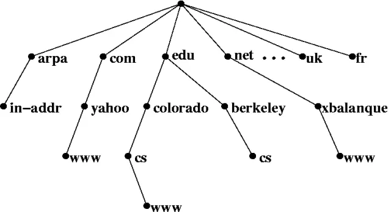
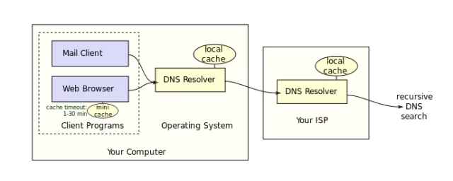

在周星驰的电影《唐伯虎点秋香》中，周星驰饰演的主角一进入华府，就被强制增加了一个代号9527。从此，华府的人开始称呼主角为9527，而不是他的姓名。

**`域名(domain name)`是IP地址的代号**。域名通常是由字符构成的，比如www.yahoo.com，要比纯粹数字构成的IP地址(106.10.170.118)容易记忆。

**`域名解析系统(DNS, domain name system)`就负责将域名翻译为对应的IP地址**。在DNS的帮助下，我们可以在浏览器的地址栏输入域名，而不是IP地址。这大大减轻了用户的记忆负担。此外，出于维护和运营的原因，一些网站可能会变更IP地址。这些网站可以更改DNS中的对应关系，从而保持域名不变，而IP地址更新。由于大部分用户记录的都是域名，这样就可以降低IP变更带来的影响。

从机器和技术的角度上来说，域名并不是必须的。但Internet是由机器和用户共同构成的。鉴于DNS对用户的巨大帮助，DNS已经被当作TCP/IP套装不可或缺的一个组成部分。

## DNS服务器

**`域名和IP地址`的对应关系存储在`DNS服务器`中。**所谓的DNS服务器，是指在网络中进行域名解析的一些服务器(计算机)。这些服务器都有自己的IP地址，并使用DNS协议(DNS protocol)进行通信。**`DNS协议`主要`基于UDP`，是`应用层协议`(这也是我们见到的第二个应用层协议)**。

DNS服务器构成一个分级(hierarchical)的树状体系。上图中，**每个节点(node)为一个DNS服务器**，每个节点都有自己的IP地址。树的顶端为用户电脑出口处的DNS服务器。在Linux下，可以使用cat /etc/resolv.conf，来查询出口DNS服务器。树的末端是真正的域名/IP对应关系记录。**一次DNS查询就是`从树的顶端节点出发`，最终找到相应末端记录的过程**。

中间节点根据域名的构成，将DNS查询引导向下一级的服务器。比如说一个域名cs.berkeley.edu，**DNS解析会将域名分割为cs, berkeley, edu，然后按照`相反的顺序查询`(edu, berkeley, cs)**。出口DNS首先根据edu，将查询指向下一层的edu节点。然后edu节点根据berkeley，将查询指向下一层的berkeley节点。这台berkeley服务器上存储有cs.berkeley.edu的IP地址。所以，中间节点不断重新定向，并将我们引导到正确的记录。

在整个DNS查询过程中，无论是重新定向还是最终取得对应关系，都是用户计算机和DNS服务器**使用DNS协议通信**。用户计算机根据DNS服务器的反馈，依次与下一层的DNS服务器建立通信。用户计算机经过递归查询，最终和末端节点通信，并获得IP地址。

## 缓存

用户计算机的操作系统中的**域名解析模块(DNS Resolver)**负责域名解析的相关工作。任何一个应用程序(邮件，浏览器)都可以通过调用该模块来进行域名解析。

并不是每次域名解析都要完整的经历解析过程。DNS Resolver通常有**DNS缓存(cache)**，用来记录最近使用和查询的域名/IP关系。在进行DNS查询之前，计算机会先查询cache中是否有相关记录。这样，重复使用的域名就不用总要经过整个递归查询过程。

## 反向DNS

上面的DNS查询均为正向DNS查询：已经知道域名，想要查询对应IP。而反向DNS(reverse DNS)是已经知道IP的前提下，想要查询域名。反向DNS也是采用分层查询方式，对于一个IP地址(比如106.10.170.118)，依次查询in-addr.arpa节点(如果是IPv6，则为ip6.arpa节点)，106节点，10节点，170节点，并在该节点获得106.10.170.118对应的域名。

