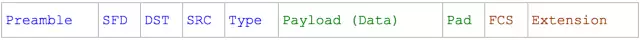
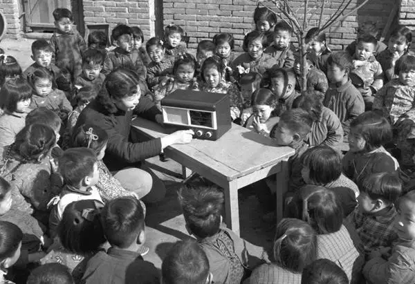
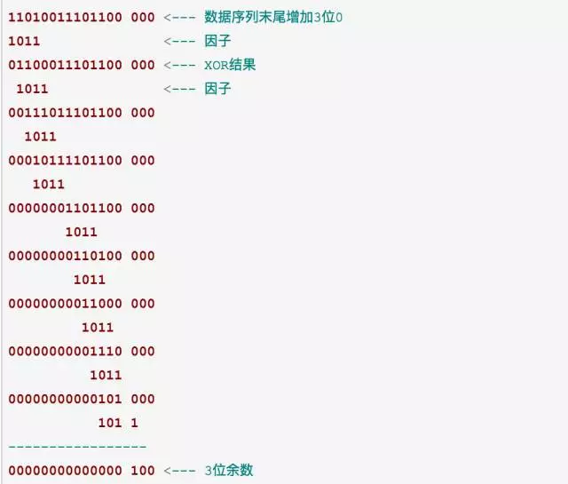
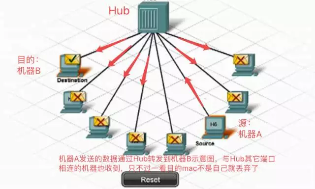
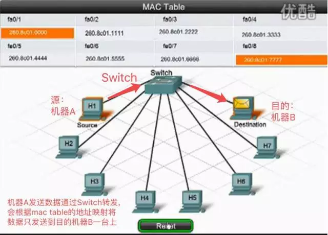

这一期的内容是**链路层**的**以太网(Ethernet)协议**与**WiFi**。

我们在邮差与邮局中说到，**以太网**和**WiFi**是链路层的两种协议。

在链路层，信息以**帧(frame)**为单位传输。帧像信封一样将数据(payload)包裹起来，并注明收信地址和送信地址。链路层实现了“本地社区”的通信。我们先来看看以太网的帧。

## 以太网的帧格式

帧本身是一段**有限的0/1序列**。它可以分为**头部**、**数据(Payload)**和**尾部**三部分:

帧按照上面的顺序从头到尾依次被发送/接收。我们下面进一步解释各个区域。

## 帧头部

帧的最初7个byte被称为**序言(preamble)**。它每个byte都是0xAA(这里是十六进制，也就是二进制的10101010)。通常，我们都会预定好以一定的频率发送0/1序列(比如每秒10bit)。如果接收设备以其他频率接收(比如每秒5bit)，那么就会错漏掉应该接收的0/1信息。但是，由于网卡的不同，发送方和接收方即使预订的频率相同，两者也可能由于物理原因发生偏差。这就好像两个人约好的10点见，结果一个人表快，一个人表慢一样。序言是为了**让接收设备调整接收频率**，以便与发送设备的频率一致，这个过程就叫做**时钟复原(recover the clock)**。

(就像在收听广播之前，调整转钮，直到声音清晰。网卡会在接收序言的过程中不断微调自己的接收频率，直到自己“听到”是...1010...)

时钟调整好之后，我们等待帧的**起始信号(SFD, start frame delimiter)**。SFD是固定的值0xAB。这个0xAB就好像“小喇叭开始广播啦”一样，提醒我们好节目就要上演了。

SFD之后是6 byte的**目的地址(DST, destination)**和6 byte的**源地址(SRC,source)**。这就是我们在邮差和邮局中的介绍一样，为信封写上目的地和发出地。要注意，这里写在信封上的是对地址的“本地描述”，也就是**MAC地址**。MAC地址是物理设备自带的序号，只能在同一个以太网中被识别 (正如邮差只熟悉自己的社区一样)。

S头部的最后一个区域是**Type**，用以说明数据部分的类型。(比如0x0800为IPv4，0x0806为ARP)

## 帧数据部分

数据一般包含有符合更高层协议的数据，比如IP包。链路层协议本身并不在乎数据是什么，它只负责传输。注意，数据尾部可能填充有一串0(**PAD**区域)。原因是数据需要超过一定的最小长度，不同的协议要求的数据最小长度是不一样的，例如：以太网(IEEE 802.3)要求帧的数据部分长度是46-1500个byte。如果数据部分不够46byte，则在数据尾部填充0以达到指定的最小长度。

## 帧尾部

跟随在数据之后的是**校验序列(FCS, Frame Check Sequence)**。校验序列是为了检验数据的传输是否发生错误。在物理层，我们通过一些物理信号来表示0/1序列(比如高压/低压，高频率/低频率等)，但这些物理信号可能在传输过程中受到影响，以致于发生错误。如何来发现我们的数据是正确的呢？

一个方法是将数据发送两遍，然后对比一下是否一样。但这样就大大降低了网络的效率。

FCS采用了CRC(Cyclic Redundancy Check)算法。这就好像是一家饭店的老板雇佣了一个收银员，但他又担心收银员黑钱。可是每天营业额很大，老板即使坐在旁边看，也不能用记住收到的总数。所以他采取了一个聪明的办法：只记住收到钱的最后一位 (比如收到19元，老板记住9)。当有新的进账(比如13，尾数为3)，他就将新的尾数和旧的尾数相加，再记住和的尾数(也就是2)。当收银员交给老板钱的时候，老板只用看总额的最后一位是否和自己记的最后一位相同，就可以知道收银员是否诚实了。如果说我们的数据是收银的总额的话，我们的FCS就是老板记录的尾数。如果两者不相符，我们就知道数据在传输的过程中出现错误，不能使用。

上面的比喻实际上是用营业总额不断的除以10，获得最终的尾数。CRC算法也相类似。n位CRC算法取一个n bit的因子，比如下面的1011。数据序列结尾增加n-1个0。因子与数据序列的不断进行XOR运算，直到得到n-1位的余数，也就是100。该余数各位取反(011)，然后存储在FCS的位置。

上面例子用的是4位CRC。在Ethernet中使用的因子为32位的，以达到更好的检测效果。

## 集线器（Hub）vs 交换器（Switch）

**以太网**使用**集线器**或者**交换器**将帧从发出地传送到目的地。一台集线器或交换器上有多个端口，每个端口都可以连接一台计算机(或其他设备)。

集线器像一个广播电台。一台电脑将帧发送到集线器，集线器会将帧转发到所有其他的端口。每台计算机检查自己的MAC地址是不是符合DST。如果不是，则保持沉默。集线器是比较早期的以太网设备。它有明显的缺陷：

1) 任意两台电脑的通信在同一个以太网上是公开的。所有连接在同一个集线器上的设备都能收听到别人在传输什么，这样很不安全。可以通过对信息加密提高安全性。

2) 不允许多路同时通信。如果两台电脑同时向集线器发信，集线器会向所有设备发出“冲突”信息，提醒发生冲突。可以在设备上增加冲突检测算法(collision detection)：一旦设备发现有冲突，则随机等待一段时间再重新发送。

交换器克服集线器的缺陷。**交换器**记录有各个设备的**MAC地址**。当帧发送到交换器时，交换器会检查DST，然后将帧只发送到对应端口。交换器允许多路同时通信。由于交换器的优越性，交换器基本上取代了集线器。但比较老的以太网还有可能在使用集线器。

上面的两个截图来自CISCO的一个视频，这个视频形象的解释了这两种设备，下面是视频的地址，有兴趣的同学可以看看：

[http://v.youku.com/v_show/id_XNDgwNTQ5OTI4.html](http://v.youku.com/v_show/id_XNDgwNTQ5OTI4.html)

##  WiFi

**WiFi**的工作方式与**集线器**连接下的以太网类似。一个WiFi设备会向所有的WiFi设备发送帧，其它的WiFi设备检查自己是否符合DST。由于WiFi采取无线电信号，所以很难像交换器一样定向发送，所以WiFi的安全性很值得关注。WiFi采用加密的方法来实现信息的安全性。

(早期的WEP加密方法非常脆弱，建议使用WPA或者WPA2加密方法。隐藏WiFi设备ID的方法不是很有用。)

## 总结

我们深入了链路层协议的一些细节。链路层是物理与逻辑的接口，它的设计兼顾了物理需求(比如时钟复原，CRC)和逻辑需求(比如地址、数据)。由于链路层处于网络逻辑的底层，有许多基于链路层的攻击手法，这需要我们对链路层的工作方式有一定的了解，以设计出更好的网络安全策略。