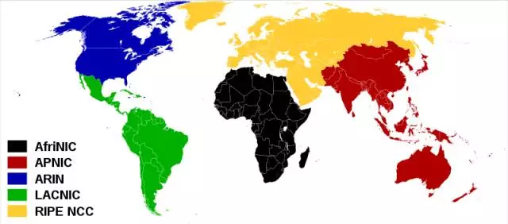
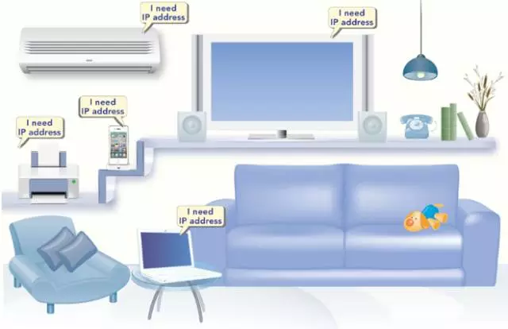
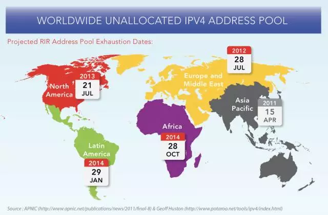

IP地址是IP协议的重要组成部分，它可以识别接入互联网中的任意一台设备。在IP接力赛中，我们已经看到，IP包的头部写有出发地和目的地的IP地址。IP包上携带的IP地址和路由器相配合，最终允许IP包从互联网的一台电脑传送到另一台。

在IP接力赛中，我们以IPv4为例说明IP包格式，其第一个4bit字段是用来说明当前所用的IP协议版本。IPv4和IPv6是先后出现的两个IP协议版本。**IPv4**的地址就是一个**32位**的0/1序列，比如11000000 00000000 0000000 00000011。

为了方便人类记录和阅读，我们通常将32位0/1分成4段8位序列，并用10进制来表示每一段(这样，一段的范围就是0到255)，段与段之间以.分隔。比如上面的地址可以表示成为192.0.0.3。**IPv6**地址是**128位**0/1序列，它也按照8位分割，以16进制来记录每一段(使用16进制而不是10进制，这能让写出来的IPv6地址短一些)，段与段之间以:分隔。

## IP地址的分配

IP地址的分配是一个政策性的问题。ICANN(the Internet Corporation for Assigned Names and Numbers)是Internet的中心管理机构。ICANN的IANA(Internet Assigned Numbers Authourity)部门负责将IP地址分配给5个区域性的互联网注册机构(RIR，Reginal Internet Registry)，比如APNIC，它负责亚太地区的IP分配。

然后RIR将地址进一步分配给当地的ISP(Internet Service Provider)，比如中国电信和中国网通。ISP再根据自己的情况，将IP地址分配给机构或者直接分配给用户，比如将A类地址分配给一个超大型机构，而将C类地址分配给一个网吧。机构可以进一步在局域网内部分配IP地址给各个主机。(A/B/C类地址请参阅IP接力赛)

并不是所有的地址都会被分配。一些地址被预留，用于广播、测试、私有网络使用等。这些地址被称为专用地址(special-use address)。你可以查询RFC5735来了解哪些地址是专用地址。

(RFC，Request For Comments。RFC是一系列的技术文档，用于记录Internet相关的技术和协议规定。每一个RFC文件都有一个固定的编号。它们是互联网的一个重要财产。你可以通过 [http://www.rfc-editor.org/](http://www.rfc-editor.org/) 来查找RFC文件)

## IPv4地址耗尽

由于IPv4协议的地址为32位，所以它可以提供232, 也就是大约**40亿**个地址。如果地球人每人一个IP地址的话，IPv4地址已经远远不够。更何况，人均持有的入网设备可能要远多于一个，下图中显示了一个家庭对IP地址的需求，这种需求量已经相当常见了：

下图显示了各大洲RIR的IPv4地址耗尽日期 (IANA已经将所有的IP分配给各个RIR)：

尽管一些技术措施(比如NAT技术，我会在其他文章中深入NAT)减缓了情况的紧急程度，但IPv4地址耗尽的一天终究还是会很快到来。很明显，我们需要更多的IP地址，以满足爆炸式增长的互联网设备对IP地址的需求。

## 更长=更好

IPv6协议的地址最重要的改进就是：加长。**IPv6**的地址为**128位**。准确的说，IPv4有4,294,967,296个地址，而IPv6有以下这么多个地址：

340,282,366,920,938,463,374,607,431,768,211,456

这是怎样一个概念呢？如果您对数字不敏感我们可以大概计算一下，地球表面积大约为510,067,866,000,000平方米。在一平方厘米(大约是指甲盖大小)的面积内，我们可以有**6.67x10^16个IP地址**！所以在短期的时间内，我们应该不会看到IPv6被用尽的尴尬。(不排除在未来计算机以分子尺寸出现，那么我们就会有IPv6耗尽危机了)

所以，为了解决IPv4地址耗尽危机，这就是结论：

## 总结

IPv4地址正在耗尽，而IPv6通过更长的序列提供了更多的IP地址。IPv4向IPv6的迁移正在发生。

阻碍迁移的过程的主要是IPv4和IPv6格式的不兼容性。老的路由器支持IPv4格式的IP包，但它们无法理解IPv6格式的IP包。所以这一迁移过程必然要伴随者设备的更新。然而，我们的许多互联网资产都是建立在IPv4网络上的，不可能一夜之间停止IPv4网络的服务而整体迁移到IPv6网络中。这一迁移过程注定充满坎坷。

