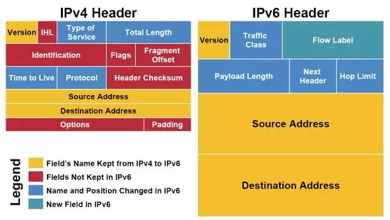
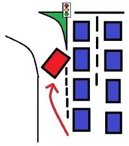
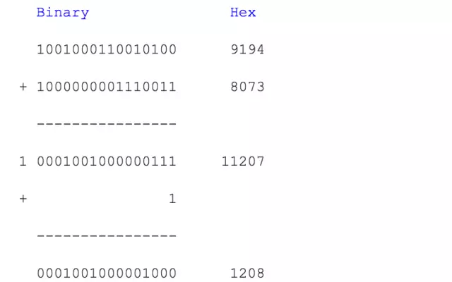

## IPV4与IPV6头部的对比

我们已经在IP接力中介绍过，一个IP包分为头部(header)和数据(payload/data)两部分。头部是为了实现IP通信必须的附加信息，数据是IP通信所要传送的信息。



```diff
! 黄色区域 (同名区域)
```

我们看到，上图中三个黄色区域跨越了IPv4和IPv6。字段`Version(4位)`表明IP协议版本，是IPv4还是IPv6(IPv4, Version=0100; IPv6, Version=0110)。`Source Adrresss`和`Destination Address`分别为发出地和目的地的IP地址。

```diff
@ 蓝色区域 （名字发生变动的区域）
```

`Time to Live 存活时间(Hop Limit in IPv6)`。表示一个IP包的最大存活时间，IPv4的这个区域记录一个整数(比如30)，IP包在传输过程中每经过一个路由器就给Time to Live减一。当一个路由器发现Time to Live为0时，那么IP包就作废，就不再发送该IP包。IPv6中的Hop Limit区域记录的也是最大路由接力数，与IPv4的功能相同。Time to Live/Hop Limit避免了IP包在互联网中无限接力。

`Type of Service 服务类型(Traffic Class in IPv6)`。Type of Service最初是用来给IP包分优先级，比如语音通话需要实时性，所以它的IP包应该比Web服务的IP包有更高的优先级。后来，Type of Service被实际分为两部分：Differentiated Service Field (DS, 前6位)和Explicit Congestion Notification (ECN, 后2位)，前者依然用来区分服务类型，而后者用于表明IP包途径路由的交通状况。IPv6的Traffic Class也被如此分成两部分。通过IP包提供不同服务。

`Protocol 协议(Next Header in IPv6)`。Protocol用来说明IP包Payload部分所遵循的协议，也就是IP包之上的协议是什么。它说明了IP包封装的是一个怎样的高层协议包(TCP? UDP?)。

`Total Length, 以及IPv6中Payload Length`的讨论要和IHL区域放在一起，我们即将讨论。

```diff
- 红色区域 (IPv6中删除的区域)
```

我们看一下IPv4和IPv6的长度信息。IPv4头部的长度。头部的最后，是`options`。每个options有32位，是选填性质的区域。一个IPv4头部可以完全没有options区域。不考虑options的话，整个IPv4头部有20 bytes(上面每行为4 bytes)。但由于有options的存在，整个头部的总长度是变动的。我们用`IHL`(Internet Header Length)来记录头部的总长度，用Total Length记录整个IP包的长度。IPv6没有options，它的头部是固定的长度40 bytes，所以IPv6中并不需要IHL区域。Payload Length用来表示IPv6的数据部分的长度。整个IP包为40 bytes + Payload Length。

IPv4中还有一个`Header Checksum`区域。这个checksum用于校验IP包的头部信息。Checksum与之前在小喇叭中提到的CRC算法并不相同。IPv6则没有checksum区域。IPv6包的校验依赖高层的协议来完成，这样的好处是免去了执行checksum校验所需要的时间，减小了网络延迟 (latency)。

`Identification, flags和fragment offset`，这三个包都是为分片重组服务的。分片是指一个路由器将接收到的IP包分拆成多个IP包传送，而接收这些“碎片”的路由器或者主机需要将“碎片”重组(reassembly)成一个IP包。不同的局域网所支持的最大传输单元(MTU, Maximum Transportation Unit)不同。如果一个IP包的大小超过了局域网支持的MTU，就需要在进入该局域网时分片传输。分片重组会给路由器和网络带来很大的负担。最好在IP包发出之前探测整个路径上的最小MTU，IP包的大小不超过该最小MTU，就可以避免碎片化。IPv6在设计上避免碎片化。每一个IPv6局域网的MTU都必须大于等于1280 bytes。IPv6的默认发送IP包大小为1280 bytes。


```diff
+ 绿色区域 (IPv6新增区域))
```
`Flow Label`是IPv6中新增的区域。它被用来提醒路由器来重复使用之前的接力路径。这样IP包可以自动保持出发时的顺序。这对于流媒体之类的应用有帮助。Flow label的进一步使用还在开发中。

## 我尽力

IP协议在产生时是一个松散的网络，这个网络由各个大学的局域网相互连接而成的，由一群随性的Geek维护。所以，IP协议认为自己所处的环境是不可靠(unreliable)的：诸如路由器坏掉、实验室失火、某个PhD踢掉电缆之类的事情随时会发生。


这样的凶险环境下，`IP协议提供的传送只能是“我尽力” (best effort)`。所谓的“我尽力”，其潜台词是，如果事情出错不要怪我，我只是答应了尽力，可没保证什么。所以，如果IP包传输过程中出现错误(比如checksum对不上，比如交通太繁忙，比如超过Time to Live)，根据IP协议，你的IP包会直接被丢掉。Game Over, 不会再有进一步的努力来修正错误。Best effort让IP协议保持很简单的形态。更多的质量控制交给高层协议处理，IP协议只负责有效率的传输。

(多么不负责任的邮递系统)

“效率优先”也体现在IP包的顺序(order)上。IP协议也不保证IP包到达的先后顺序。我们已经知道，IP接力是根据routing table决定接力路线的。如果在连续的IP包发送过程中，routing table更新(比如有一条新建的捷径出现)，那么后发出的IP包选择走不一样的接力路线。如果新的路径传输速度更快，那么后发出的IP包有可能先到。



IPv6中的Flow Label可以建议路由器将一些IP包保持一样的接力路径。但这只是“建议”，路由器可能会忽略该建议。

## Header Checksum算法

Header Checksum区域有16位。它是这样获得的，从header取得除checksum之外的0/1序列，如：9194 8073 0000 4000 4011 C0A8 0001 C0A8 00C7 (十六进制hex, 这是一个为演示运算过程而设计的header)

按照十六位(也就是4位hex)分割整个序列。将分割后的各个4位hex累积相加。如果有超过16位的进位出现，则将进位加到后16位结果的最后一位：



上面的计算叫做one's complement sum。求得所有十六位数的和，

one's complement sum(4500, 0073, 0000, 4000, 4011, C0A8, 0001, C0A8, 00C7) = 1433

然后，将1433的每一位取反(0->1, 1->0)， 就得到checksum：EBCC这样，我们的header就是:9194 8073 0000 4000 4011 ++EBCC++ C0A8 0001 C0A8 00C7

IP包的接收方在收到IP包后，可以求上面各个16位数的one's complement sum，应该得到FFFF。如果不是FFFF，那么header是不正确的，整个IP包会被丢弃。

(再次提醒，示例所用的IP header不是真实的header，它只是起演示算法的作用)

## 总结

每个网络协议的形成都有其历史原因。如IP协议是为了将各个分散的实验室网络连接起来。由于当时的网络很小，所以IPv4(IPv4产生与70年代)的地址总量为40亿。尽管当时被认为是很大的数字，但数字浪潮很快带来了地址耗尽危机。IPv6的主要目的是增加IPv4的地址容量，但同时根据IPv4的经验和新时代的技术进步进行改进，比如避免碎片化，比如取消checksum (由于高层协议TCP的广泛使用)。网络协议技术上并不复杂，更多的考量是政策性的。

IP协议是"Best Effort"式的，IP传输是不可靠的。但这样的设计成就了IP协议的效率。


