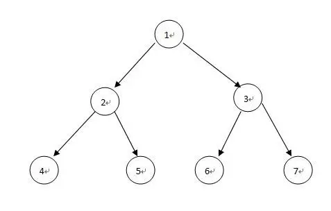
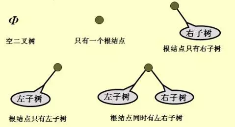
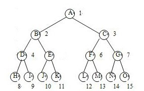
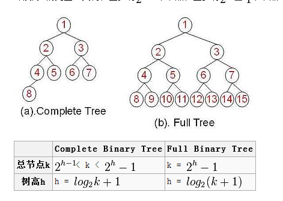

## 自由树

自由树是一个连通的，无回路的无向图。

令G=(V，E)为一个无向图。下面的表述是等价的。G表示一个图，V是图G中顶点的集合，E是图G中边的集合；

>1)        G是自由树。
>
>2)        G中任意两个顶点由唯一一条简单路径得到。
>
>3)        G是连通的，但从E中去掉任何边后得到的图都是非连通的。
>
>4)        G是无回路的，且|E|=|V|-1。
>
>5)        G是连通的，且|E|=|V|-1。
>
>6)        G是无回路的，但添加任何边到E中得到的图包含回路。

## 二叉树

二叉树是**每个节点最多有两个子树**的树结构。通常子树被称作“左子树”（left subtree）和“右子树”（right subtree）。

### 二叉树的性质：

>1、二叉树的每个结点至多只有二棵子树(**不存在度大于2的结点**)；
>
>2、二叉树的子树有左右之分，**次序不能颠倒**。
>
>3、二叉树的**第i层至多**有**2^(i-1)个结点**；
>
>4、**深度为k**的二叉树**至多**有**2^k-1个结点**；（等比数列1+2+4+…+2^(k-1) = 2^k-1。
>
>5、对任何一棵二叉树T，如果其终端结点数为n0，度为2的结点数为n2，则n0 = n2 + 1。

### 树和二叉树的三个主要差别：

>1)  树的结点个数至少为1，而二叉树的结点个数可以为0；
>
>2)  树中结点的最大度数没有限制，而二叉树结点的最大度数为2；
>
>3)  树的结点无左、右之分，而二叉树的结点有左、右之分。

### 二叉树的五种基本形态:

## 满二叉树

一棵深度为k，且有2^k-1个节点的树是满二叉树。

从树的外形来看，满二叉树是严格三角形的，大家记住下面的图，它就是满二叉树的标准形态：

所有内部节点都有两个子节点，最底一层是叶子节点。

### 满二叉树的性质：

>1)        如果一颗树深度为h，最大层数为k，且深度与最大层数相同，即k=h;
>
>2)        它的叶子数是： 2^(h-1)
>
>3)        第k层的结点数是： 2^(k-1)
>
>4)        总结点数是： 2^k-1 (2的k次方减一)
>
>5)        总节点数一定是奇数。
>
>6)        树高：h=log2(n+1)。

## 完全二叉树

完全二叉树是由满二叉树而引出来的。对于深度为K的，有n个结点的二叉树，当且仅当其每一个结点都与深度为K的满二叉树中编号从1至n的结点一一对应时称之为完全二叉树。

若设二叉树的深度为h，除第 h 层外，其它各层 (1～h-1) 的结点数都达到最大个数，第h 层所有的结点都连续集中在最左边，这就是完全二叉树。

（大家好好理解一下上面两个定义，是等价的~~）

满二叉树一定是完全二叉树，完全二叉树不一定是满二叉树。

下面是完全二叉树的基本形态：

### 完全二叉树的性质：

>1)        深度为k的完全二叉树，至少有2^(k-1)个节点，至多有2^k-1个节点。
>
>2)        树高h=log2n + 1。

### 对满二叉树、完全二叉树总结点及树高的总结：

