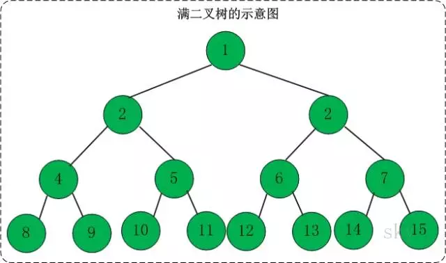
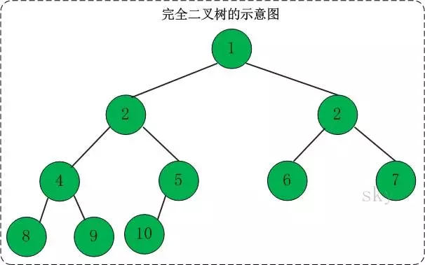

## 树的介绍

### 树的定义

树是一种数据结构，它是由n（n>=0）个有限节点组成一个具有层次关系的集合，把它叫做“树”是因为它看起来像一棵倒挂的树，也就是说它是根朝上，而叶朝下的。它具有以下的特点：

>- 每个节点有零个或多个子节点；
>
>- 没有父节点的节点称为根节点；
>
>- 每一个非根节点有且只有一个父节点；
>
>- 除了根节点外，每个子节点可以分为多个不相交的子树。

### 树的基本术语

若一个结点有子树，那么该结点称为子树的"**双亲**"，子树是该结点的"**孩子**"。有相同双亲的结点互为"**兄弟**"。一个结点的所有子树上的任何结点都是该结点的"**后裔**"。从根结点到某个结点的路径上的所有结点都是该结点的"**祖先**"，以下图为例：

>**结点的度**：结点拥有的子树的数目，图中结点c的度为2。
>
>**叶子**：度为零的结点，图中D、E、F都是叶子结点
>
>**树的度**：树中结点的最大的度，图中结点c的度最大为2，因此树的度为2。
>
>**层次**：根结点的层次为1，其余结点的层次等于该结点的双亲结点的层次加1。
>
>**树的高度**：树中结点的最大层次，图中树的高度为3。
>
>**无序树**：如果树中结点的各子树之间的次序是不重要的，可以交换位置。
>
>**有序树**：如果树中结点的各子树之间的次序是重要的, 不可以交换位置。
>
>**森林**：0个或多个不相交的树组成。对森林加上一个根，森林即成为树；删去根，树即成为森林。

## 二叉树介绍

### 二叉树定义

二叉树是**每个节点最多有两个子树**的树结构。它有五种基本形态：

### 二叉树性质

性质1：二叉树第i层上的结点数目最多为 2^(i-1) (i≥1)。

>证明：下面用"数学归纳法"进行证明。
>(01) 当i=1时，第i层的节点数目为2{i-1}=2{0}=1，命题成立。
>(02) 假设当i>1，第i层的节点数目为2{i-1}。这个是根据第一步推断出来的！
下面根据这个假设，推断出"第(i+1)层的节点数目为2{i}"即可。由于二叉树的每个结点至多有两个孩子，故"第(i+1)层上的结点数目" 最多是 "第i层的结点数目的2倍"。即，第(i+1)层上的结点数目最大值=2×2{i-1}=2{i}。故假设成立，原命题得证！

性质2：深度为k的二叉树至多有2^k-1个结点(k≥1)。

>证明：在具有相同深度的二叉树中，当每一层都含有最大结点数时，结点数最多。利用"性质1"可知，深度为k的二叉树的结点数至多为：20+21+…+2k-1=2k-1。故原命题得证！

性质3：包含n个结点的二叉树的高度至少为log~2~(n+1)。

>证明：根据"性质2"可知，高度为h的二叉树最多有2^k-1个结点。反之，对于包含n个节点的二叉树的高度至少为log~2~(n+1)。

性质4：二叉树中,设叶子结点数为n0，度为2的结点数为n2，则n0=n2+1。

>证明：
>1）因为二叉树中所有结点的度数均不大于2，所以有等式一： n=n0+n1+n2(等式一)
>2）另一方面，0度结点没有孩子，1度结点有一个孩子，2度结点有两个孩子，故二叉树中孩子结点总数是：n1+2n2。此外，只有根不是任何结点的孩子。故二叉树中的结点总数又可表示为等式二：n=n1+2n2+1(等式二)
>3）由(等式一)和(等式二)计算得到：n0=n2+1。原命题得证！

## 不同形态二叉树

### 满二叉树

定义：**高度为h，并且由2{h} –1个结点的二叉树，被称为满二叉树**，其实不难看出，满二叉树的结点的度要么为0（叶子结点），要么为2（非叶子结点）

### 完全二叉树

定义：一棵二叉树中，只有最下面两层结点的度可以小于2，并且最下一层的叶结点集中在靠左的若干位置上。这样的二叉树称为完全二叉树。

特点：叶子结点只能出现在最下层和次下层，且最下层的叶子结点集中在树的左部。显然，一棵满二叉树必定是一棵完全二叉树，而完全二叉树未必是满二叉树。

### 二叉查找树

定义：二叉查找树，又被称为二叉搜索树。其特点如下：

可以看出，在二叉树中：

>1、若任意节点的左子树不空，则左子树上所有结点的值均小于它的根结点的值；
>
>2、任意节点的右子树不空，则右子树上所有结点的值均大于它的根结点的值；
>
>3、任意节点的左、右子树也分别为二叉查找树；
>
>4、没有键值相等的节点。

