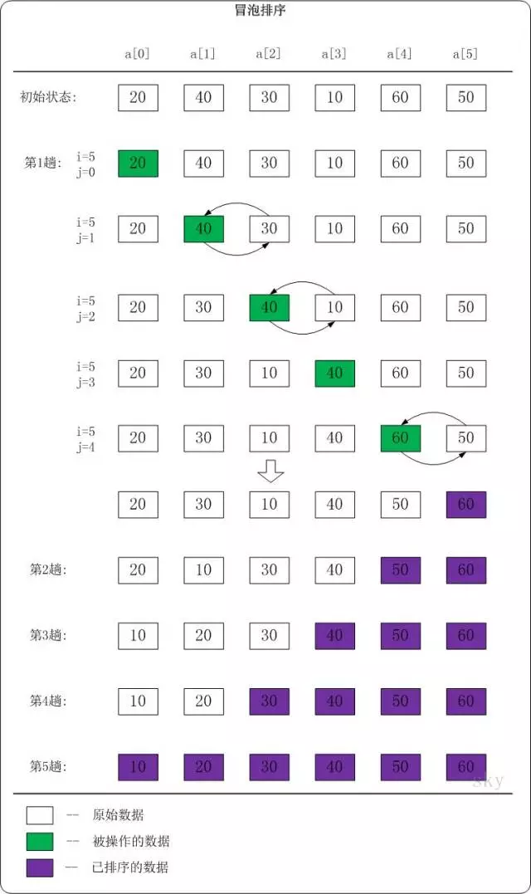

## 冒泡排序介绍

冒泡排序一种简单的排序算法。它会遍历若干次要排序的数列，每次遍历时，它都会从前往后依次的比较相邻两个数的大小；如果前者比后者大，则交换它们的位置。这样，一次遍历之后，最大的元素就在数列的末尾！ 采用相同的方法再次遍历时，第二大的元素就被排列在最大元素之前。重复此操作，直到整个数列都有序为止！

## 冒泡排序图解

下面以数列{20,40,30,10,60,50}为例，演示它的冒泡排序过程(如下图)。



我们首先分析第一趟排序：

>当i=5,j=0时，a[0]<a[1]。此时，不做任何处理！

>当i=5,j=1时，a[1]>a[2]。此时，交换a[1]和a[2]的值；交换之后，a[1]=30，a[2]=40。

>当i=5,j=2时，a[2]>a[3]。此时，交换a[2]和a[3]的值；交换之后，a[2]=10，a[3]=40。

>当i=5,j=3时，a[3]<a[4]。此时，不做任何处理！

>当i=5,j=4时，a[4]>a[5]。此时，交换a[4]和a[5]的值；交换之后，a[4]=50，a[3]=60。

第一趟排完之后，最大元素60移到数组最后了，也就是a[5]此时为数组中最大的元素，再进行第二趟排序的时候，只需按照上面的方法排前面5个元素就可以了。这样：

第2趟排序完之后，数列中a[4]、a[5]是有序的。
第3趟排序完之后，数列中a[3]、a[4]、a[5]是有序的。
第4趟排序完之后，数列中a[2]、[3]、a[4]、a[5]是有序的。
第5趟排序完之后，数列中a[1]、a[2]、[3]、a[4]、a[5]是有序的。

第5趟排序之后，整个数列也就是有序的了。

## 冒泡排序算法实现

根据上面流程，不难写出冒泡排序的代码实现，此处是按升序排列。

```JAVA
void bubble_sort(int a[], int n)
{
    int i,j;

    for (i=n-1; i>0; i--)
    {
        // 将a[0...i]中最大的数据放在末尾
        for (j=0; j<i; j++)
        {
            if (a[j] > a[j+1])
                swap(a[j], a[j+1]);
        }
    }
}
```

其实观察上面例子冒泡排序的流程图，第3趟排序之后，数据已经是有序的了；第4趟和第5趟并没有进行数据交换。因此可以对冒泡排序进行优化，使它效率更高一些：
++添加一个标记，如果一趟遍历中发生了交换，则标记为true，否则为false。如果某一趟没有发生交换，说明排序已经完成，退出++。
优化后的代码如下：

```JAVA
void bubble_sort2(int a[], int n)
{
    int i,j;
    int flag;     // 标记一趟是否发生交换

    for (i=n-1; i>0; i--)
    {
        flag = 0;     // 初始化标记为0

        // 将a[0...i]中最大的数据放在末尾
        for (j=0; j<i; j++)
        {
            if (a[j] > a[j+1])
            {
                swap(a[j], a[j+1]);
                flag = 1; //发生交换，设flag为1
            }
        }

        if (flag==0)
            break; // 若无交换，说明数列已有序
    }
}
```

## 冒泡排序时间空间复杂度

冒泡排序的时间复杂度是**O(N^2^)**：假设被排序的数列中有N个数。遍历一趟的时间复杂度是O(N)，需要遍历多少次呢？N-1次！因此，冒泡排序的时间复杂度O(N^2^)。

冒泡排序是**稳定的**算法：它满足稳定算法的定义；

++所谓算法稳定性指的是对于一个数列中的两个相等的数a[i]=a[j]，在排序前,a[i]在a[j]前面，经过排序后a[i]仍然在a[j]前，那么这个排序算法是稳定的。++

## PHP版本
```PHP
<?php
function bubble_sort(&$arr) {
    for($i = count($arr) - 1; $i > 0; $i--) {
        $flag = 0;
        for($j = 0; $j < $i; $j++) {
            if($arr[$j] > $arr[$j + 1]) {
                $t = $arr[$j];
                $arr[$j] = $arr[$j + 1];
                $arr[$j + 1] = $t;
                $flag = true;
            }
        }
        if(0 == $flag) {
            break;
        }
    }
}

$arr = array(2, 3, 2, 3, 4, 1, 0);
bubble_sort($arr);
print_r($arr);

```


