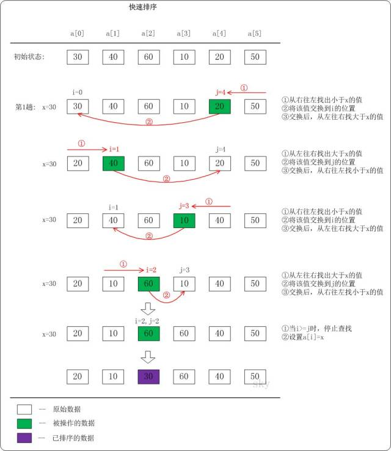

## 快速排序介绍

快速排序(Quick Sort)使用分治法策略。它的基本思想是：
选择一个基准数，通过一趟排序将要排序的数据分割成独立的两部分；其中一部分的所有数据都比另外一部分的所有数据都要小。然后，再按此方法对这两部分数据分别进行快速排序，整个排序过程可以递归进行，以此达到整个数据变成有序序列。

快速排序流程如下：

>从数列中挑出一个**基准值**。
>
>将所有比基准值小的摆放在基准前面，所有比基准值大的摆在基准的后面(相同的数可以到任一边)；在这个分区退出之后，该基准就处于数列的中间位置。
>
>递归地把"基准值前面的子数列"和"基准值后面的子数列"进行排序。

## 快速排序图文说明

下面以数列a={30,40,60,10,20,50}为例，演示它的快速排序过程(如下图)。下图只是给出了第1趟快速排序的流程。在第1趟中流程如下，首先设置**基数x=a[i]=a[0]**，即x=30。



>从"右 --> 左"查找小于x的数：找到满足条件的 数 a[j]=20，此 时j=4；然后将a[j]赋值a[i]，此时i=0；接着从左往右遍历；

>从"左 --> 右"查找大于x的数：找到满足条件的数a[i]=40，此时i=1；然后将a[i]赋值a[j]，此时j=4；接着从右往左遍历；

>从"右 --> 左"查找小于x的数：找到满足条件的数a[j]=10，此时j=3；然后将a[j]赋值a[i]，此时i=1；接着从左往右遍历。

>从"左 --> 右"查找大于x的数：找到满足条件的数a[i]=60，此时i=2；然后将a[i]赋值a[j]，此时j=3；接着从右往左遍历。

>从"右 --> 左"查找小于x的数：没有找到满足条件的数。当i>=j 时，停止查找；然后将x赋值给a[i]。第一趟遍历结束！

根据上面的思路，不难写出下面的快速排序实现：

```JAVA
/*
 * 快速排序
 *
 * 参数说明：
 *     a -- 待排序的数组
 *     l -- 数组的左边界(例如，从起始位置开始排序，则l=0)
 *     r -- 数组的右边界(例如，排序截至到数组末尾，则r=a.length-1) */
void quick_sort(int a[], int l, int r)
{
    if (l < r)
    {
        int i,j,x;

        i = l;
        j = r;
        x = a[i];
        while (i < j)
        {
            while(i < j && a[j] > x)
                j--; // 从右向左找第一个小于x的数
            if(i < j)
                a[i++] = a[j];
            while(i < j && a[i] < x)
                i++; // 从左向右找第一个大于x的数
            if(i < j)
                a[j--] = a[i];
        }
        a[i] = x;
        quick_sort(a, l, i-1); /* 递归调用 */
        quick_sort(a, i+1, r); /* 递归调用 */
    }
}
```

## 快速排序的时间复杂度和稳定性

快速排序的时间复杂度：快速排序的时间复杂度在最坏情况下是<font color=red>__O(N)__</font>，最好情况下是<font color=red>__O(logN)__</font>，平均的时间复杂度是<font color=red>__O(N*lgN)__</font>。这句话很好理解：假设被排序的数列中有N个数。遍历一次的时间复杂度是O(N)，需要遍历多少次呢？至少lg(N+1)次，最多N次。

为什么最少是lg(N+1)次？快速排序是采用的分治法进行遍历的，我们将它看作一棵二叉树，它需要遍历的次数就是二叉树的深度，而根据完全二叉树的定义，它的深度至少是lg(N+1)。因此，快速排序的遍历次数最少是lg(N+1)次。

为什么最多是N次？这个应该非常简单，还是将快速排序看作一棵二叉树，它的深度最大是N。因此，快读排序的遍历次数最多是N次。

快速排序的稳定性：快速排序是<font color=red>__不稳定的__</font>算法，它不满足稳定算法的定义；所谓算法稳定性指的是对于一个数列中的两个相等的数a[i]=a[j]，在排序前,a[i]在a[j]前面，经过排序后a[i]仍然在a[j]前，那么这个排序算法是稳定的。

## PHP 版本

```PHP
function quick_sort(&$arr, $l, $r) {
    if($l < $r) {
        $i = $l;
        $j = $r;
        $x = $arr[$i];
        while($i < $j) {
            while($i < $j && $arr[$j] > $x) $j--;
            if($i < $j) $arr[$i++] = $arr[$j];
            while($i < $j && $arr[$i] < $x) $i++;
            if($i < $j) $arr[$j--] = $arr[$i];
        }
        $arr[$i] = $x;
        quick_sort($arr, $l, $i - 1);
        quick_sort($arr, $j + 1, $r);
    }
}

$arr = array(2, 3, 2, 11, 8, 3, 4, 1, 11, 0, 33);
quick_sort($arr, 0, count($arr) - 1);
print_r($arr);
```