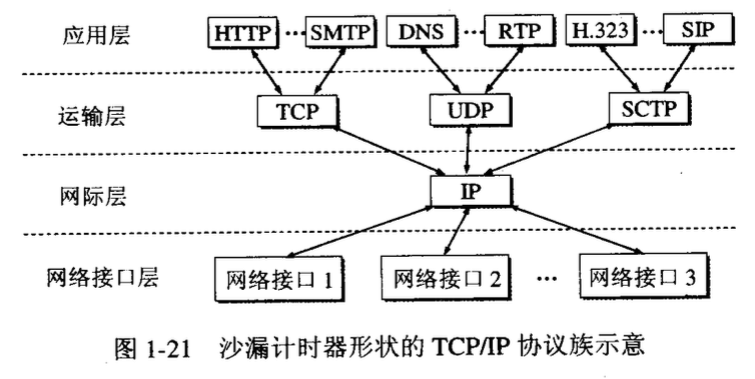
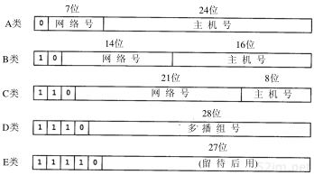

## 概述

1. **应用层**：++直接为用户的应用进程提供服务++，如 HTTP、支持文件传输的 FTP 协议等
2. **运输层**：++向两个主机中进程之间的通信提供服务++。由于一个主机可同时运行多个进程，因此运输层有复用和分用的功能。复用就是多个应用层进程可同时使用下面运输层的服务。分用则是运输层把收到的信息分别交付给上面应用层中的相应的进程。运输层主要使用以下两种协议：1.传输控制协议++TCP++（数据传输的单位是报文段）2.用户数据报协议++UDP++（数据传输的单位是用户数据报），不保证提供可靠的交付，只能提供“尽最大努力交付”
3. **网络层**：使用无连接的网际协议 IP 和许多种路由选择协议。负责++为分组交换网上的不同主机提供通信服务++，把运输层产生的报文段或用户数据报封装成分组（也叫IP数据报或数据报）或包进行传送。网络层的另一个任务就是选择合适的路由。
4. **数据链路层（链路层）**：将网络层交下来的 IP 数据报组装成帧，++在两个相邻结点（主机和路由器，或两个路由器）之间的链路上“透明”地传送帧中的数据++。每一帧包括数据和必要的控制信息（如同步信息、地址信息、差错控制等）。
（透明表示无论什么样的比特组合的数据都能够通过这个数据链路层）
如发现有差错，会简单的丢弃帧。如果需要改正错误，由运输层的 TCP 来完成。
5. **物理层**：传送数据的单位是比特。物理层的任务就是++透明地传送比特流++。要考虑用多大的电压代表“1” 或 ”0”，以及接受方如何识别出发送方所发的比特。还要确定连接电缆的插头应当有多少根引脚以及各条引脚应如何连接。
当然，哪几个比特代表什么意思，则不是物理层所要管的。
请注意，传递信息所利用的一些物理媒体，如双绞线、同轴电缆、光缆、无线信道等，并不在物理层协议之内而是在物理层协议的下面。因此也有人把物理媒体层当作第0层。

第2层（数据链路层）数据单元 PDU 的首尾都要加上控制信息。
物理层不需要加控制信息，但要注意传送比特流时应从首部开始传送。

## TCP/IP 四层协议

TCP/IP 协议可以为各式各样的应用提供服务（所谓的 ==**everything over IP**==），同时
TCP/IP 协议也允许 IP 协议在各式各样的网络构成的互联网上运行（所谓的 ==**IP over everything**==）

## 互联网地址

互联网上的每个接口必须有一个唯一的Internet地址（也称作IP地址）。IP地址长32 bit。IP地址具有一定的结构，五类不同的互联网地址格式如图1-5所示，IP地址分为五类，A类保留给政府机构，B类分配给中等规模的公司，C类分配给任何需要的人，D类用于组播，E类用于实验，各类可容纳的地址数目不同。（前面的数字是固定的！）

*网络号：用于识别主机所在的网络；
主机号：用于识别该网络中的主机；*

A类详解：A类地址的网络标识由第一组8位二进制数表示， A类地址的特点是网络标识的第一位二进制数取值必须为0。不难算出，A类地址第一个地址为00000001，最后一个地址是01111111，换算成十进制就是127，其中127留作保留地址。
A类地址的第一段范围是：1～126，A类地址允许有2^7^ -2=126个网段（减2是因为0不用，127留作它用）。
网络中的主机标识占3组8位二进制数，每个网络允许有2^24^-2=16777214台主
机（减2是因为全0地址为网络地址，全1为广播地址，这两个地址一般不分配给主机）。

## 用户数据封装和分用

应用程序用TCP传送数据时，数据被送入协议栈中，然后逐个通过每一层直到被当作一串比特流送入网络。其中每一层对收到的数据都要增加一些首部信息（有时还要增加尾部信息），该过程如图1-7所示。TCP传给IP的数据单元称作TCP报文段或简称为TCP段（TCP segment）。IP传给网络接口层的数据单元称作IP数据报(IP datagram)。通过以太网传输的比特流称作帧(Frame)

当目的主机收到一个以太网数据帧时，数据就开始从协议栈中由底向上升，同时去掉各层协议加上的报文首部。每层协议盒都要去检查报文首部中的协议标识，以确定接收数据的上层协议。这个过程称作分用（Demultiplexing）

## 端口号

服务器一般通过端口号来识别对应的应用程序。TCP和UDP采用16 bit的端口号来识别应用程序。任何TCP/IP实现所提供的服务都用知名的1～1023之间的端口号。大多数TCP/IP实现给临时端口分配1024～5000之间的端口号。大于5000的端口号是为其他服务器预留的（Internet上并不常用的服务)

> 到1992年为止，知名端口号介于1～255之间。256～1023之间的端口号通常都是由Unix系统占用，以提供一些特定的Unix服务—也就是说，提供一些只有Unix系统才有的、而其他操作系统可能不提供的服务。现在IANA管理1～1023之间所有的端口号。

## 应用编程

TCP/IP协议的应用程序通常采用两种应用编程接口（API）：socket和TLI（已经被淘汰）。就目前而言，几乎所有的应用程序都是采用socket。